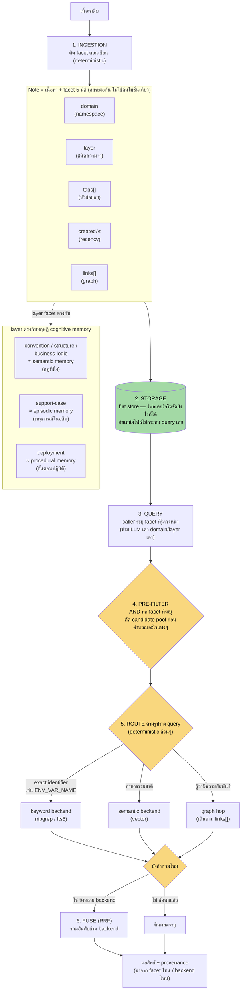

# Template ไฟล์ vault สำหรับ agent memory

เอกสารอ้างอิงว่าไฟล์ใน `vault/` ควรมีโครงสร้างและ template ยังไง — สรุปจากหลักการที่พิสูจน์แล้วจริงในโปรเจกต์นี้ (วัดผลที่ 1,945 ไฟล์ ดู [`../README.md`](../README.md) หัวข้อ 7 และ [`../plans/12-domain-facet.md`](../plans/12-domain-facet.md))

---

## 1. Path template — วาง domain/layer ยังไง

```
vault/
  <layer>/                    ← 5 ค่าตายตัว: convention | structure | business-logic | deployment | support-cases
    <file>.md                 ← ไม่มี subfolder = domain "core" (เนื้อหาหลักขององค์กร/โปรเจกต์)
    <domain-slug>/            ← subfolder ตามชื่อ domain (เช่น "warehouse-robotics")
      <file>.md                 domain = ชื่อ subfolder
```

**กติกา:** `layer` มาก่อนเสมอ (โฟลเดอร์ชั้นแรก) `domain` เป็นชั้นที่สอง (มีหรือไม่มีก็ได้) — เหตุผลที่ `layer` ต้องมาก่อนคือ `vault-reader.ts` validate ชื่อโฟลเดอร์ชั้นแรกกับ frontmatter `layer` ตรงๆ (fail-fast ถ้าไม่ตรง)

> **หมายเหตุ implementation ปัจจุบัน:** โค้ดที่มีอยู่ (`deriveDomain()` ใน `src/core/vault-reader.ts`) บังคับ subfolder ต้องขึ้นต้นด้วย `synthetic-` เพราะออกแบบมาสำหรับ distractor content ของการทดลอง scale test โดยเฉพาะ — ถ้าจะเอา pattern นี้ไปใช้จริงกับ production vault ควรตัด prefix `synthetic-` ออก ใช้แค่ `<domain-slug>/` ตรงๆ

---

## 2. Frontmatter template (universal — ทุกไฟล์ทุก layer ใช้เหมือนกัน)

```yaml
---
layer: business-logic              # required, ต้องตรงกับชื่อโฟลเดอร์ชั้นแรก
tags: [refund, timeout]            # required, อย่างน้อย 1 — ไม่ใช่ domain (domain มาจาก path ไม่ใช่ frontmatter)
created: 2026-08-28                # required, ISO date
links:                             # optional, default []
  - "[[business-logic/refund-timeout-policy-edge-cases]]"
---

# หัวเรื่อง (H1 — ใช้เป็น title ตอนแสดงผล search result)

เนื้อหา...
```

**ทำไม `domain` ไม่อยู่ใน frontmatter:** ตัดสินใจแล้วให้ derive จาก path แทน (ดู [`../plans/12-domain-facet.md`](../plans/12-domain-facet.md)) — ประหยัดไม่ต้องเขียนซ้ำในทุกไฟล์ และรับประกันว่า path กับ metadata ไม่มีทาง drift ไปคนละทาง

---

## 3. Content template ต่อ layer

5 layer = 5 รูปแบบเนื้อหาที่ต่างกันจริง (ไม่ใช่แค่ folder แบ่งไว้เฉยๆ) — แต่ละ layer ตรงกับ "ชนิดความจำ" ทฤษฎี cognitive memory คนละแบบ:

| layer | ตรงกับ memory type | ลักษณะการเขียน |
|---|---|---|
| `structure`, `business-logic`, `convention` | semantic memory (กฎที่ค่อนข้างนิ่ง) | อธิบายกฎ |
| `support-cases` | episodic memory (เหตุการณ์เฉพาะจุดในอดีต) | เล่าเรื่องที่เกิดขึ้น |
| `deployment` | procedural memory (ขั้นตอนปฏิบัติ) | สั่งขั้นตอน |

### `structure/` — module/component

```markdown
# <module-name>

<คำอธิบาย 2-4 ประโยค: ทำไมแยกเป็น module นี้ แยกจากอะไร>

## Functions
- `functionName(param: type): ReturnType` — คำอธิบายสั้น
- ...(3-4 ตัว)

## State flow
`state1 → state2 → state3` — คำอธิบาย transition

## Related
เชื่อมกับ [[module-อื่น]] ยังไง — ใช้ wikilink เสมอ ไม่ใช่พิมพ์ชื่อเฉยๆ
```

บาง module มีไฟล์ companion แยก (`<module>-internals.md`) เก็บ constant/type ดิบล้วนๆ ไม่มี business rule ปน — ใช้กับ module ที่ซับซ้อนพอเท่านั้น ไม่ต้องทุกไฟล์

### `business-logic/` — policy

```markdown
# นโยบาย<ชื่อเรื่อง>

<intro 1-3 ย่อหน้า อธิบาย policy หลัก — ต้องมีตัวเลข/เงื่อนไขที่เจาะจง ไม่ใช่พูดกว้างๆ>

## <หัวข้อเสริมถ้ามี>
...
```

policy สำคัญ (primary) แยก edge case ออกเป็นไฟล์ companion (`<policy>-edge-cases.md`) เพื่อไม่ให้ policy หลักอ่านยาก — ใช้กับ policy ที่มีเงื่อนไขพิเศษเยอะเท่านั้น

### `support-cases/` — incident

```markdown
# <หัวเรื่องเหตุการณ์>

## สรุป
<เกิดอะไรขึ้น สั้นๆ>

## การสืบสวน
<ตรวจอะไร เจออะไร>

## สาเหตุ
<root cause>

## การแก้ไข
<แก้ยังไงตอนนั้น>

## Follow-up
<จะป้องกันซ้ำยังไง — มักอ้างอิงกลับไปที่ policy ใน business-logic/>
```

โครงนี้บังคับ **5 ส่วนเสมอ** (สรุป/สืบสวน/สาเหตุ/แก้ไข/follow-up) เพราะ episodic memory ที่ดีต้องตอบได้ครบว่า "เกิดอะไร → ทำไม → แก้ยังไง → ป้องกันยังไง" ไม่ใช่แค่บันทึกเหตุการณ์เฉยๆ

### `convention/` — ทีม/coding standard

```markdown
# <ชื่อ convention>

## <หัวข้อ>
<กติกา + เหตุผลสั้นๆ ว่าทำไมกำหนดแบบนี้>

## <หัวข้อถัดไป>
...
```

**คำเตือนจากที่วัดจริง:** ถ้าเขียน convention หลาย domain ด้วย template เดียวกันเป๊ะ (เปลี่ยนแค่ชื่อโปรเจกต์) จะเกิด cosine similarity สูงถึง 0.77-0.89 ข้าม domain (วัดจริงในโปรเจกต์นี้ ดู README หัวข้อ 7.6) — ถ้าต้องมีหลาย domain จริง ให้เขียนเนื้อหาที่ต่างกันจริง หรือพึ่ง domain filter ช่วยตัด ไม่ใช่หวังว่า vector search จะแยกให้เอง

### `deployment/` — ขั้นตอนปฏิบัติ

```markdown
# <ชื่อหัวข้อ deployment>

<intro ถ้าจำเป็น — บอกขอบเขตว่าเอกสารนี้ครอบคลุมอะไร ไม่ครอบคลุมอะไร>

## <ขั้นตอน 1>
<action + เหตุผล>

## <ขั้นตอน 2>
...
```

deployment มักมีตาราง (เช่น timeout config, scaling threshold) — ใส่ markdown table ตรงๆ ได้เลย ไม่ต้องบรรยายเป็นร้อยแก้ว

---

## 4. Flow structure เต็มรูปแบบ (ingestion → storage → query)



**หัวใจของโครงสร้างนี้:** ขั้น 4 (pre-filter ตาม facet) ต้องมาก่อนขั้น 5 (semantic ranking) เสมอ — facet filter เป็นการตัดสินใจแบบ binary ไม่กำกวม (ใช่/ไม่ใช่ domain นี้) ในขณะที่ semantic search มีความกำกวมโดยธรรมชาติ ตัดตัวที่แน่นอนก่อนเสมอเพื่อลด surface area ให้ตัวที่ไม่แน่นอนทำงานน้อยลง — หลักการเดียวกับที่ domain facet ([plans/12-domain-facet.md](../plans/12-domain-facet.md)) เพิ่งแก้ปัญหา vector recall ได้จริงในโปรเจกต์นี้ (recall vector 0.53 → 0.75 ที่ 1,945 ไฟล์ ดู README หัวข้อ 7.6)
